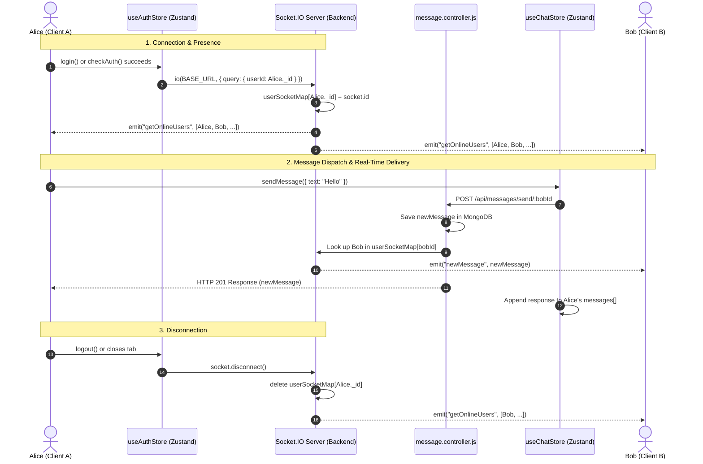

# Real-Time WebSockets Architecture in ChatX

A complete technical breakdown of how real-time communication works in this project, the tools and libraries used, the step-by-step lifecycle across frontend and backend files, current design flaws, and areas for advanced improvement.

---

## 1. Technologies & Tools Used

| Tool | Role | Where It's Installed |
| :--- | :--- | :--- |
| **Node.js `http` module** | Built-in HTTP server wrapper required to bind both Express and WebSockets to the same port. | Backend (Node.js runtime) |
| **Express (`express@5.x`)** | Handles REST APIs, middleware, JSON parsing, cookies, and routes. | Backend (`backend/package.json`) |
| **Socket.IO (`socket.io@4.x`)** | Real-time WebSocket engine on the server. Handles handshakes, connections, heartbeats, and room/client emissions. | Backend (`backend/package.json`) |
| **Socket.IO Client (`socket.io-client@4.x`)** | Client-side WebSocket library that connects to the Socket.IO server, manages auto-reconnections, and listens for events. | Frontend (`frontend/package.json`) |
| **Zustand (`zustand@5.x`)** | Global client state management that stores the active `socket` instance, `onlineUsers`, and real-time `messages`. | Frontend (`frontend/package.json`) |

---

## 2. End-to-End WebSocket Architecture & Flow



---

## 3. File-by-File Implementation Walkthrough

### A. Backend Files

#### 1. [`backend/src/lib/socket.js`](file:///c:/chattyapp/backend/src/lib/socket.js) — The Real-Time Hub
This is where the server is created and the WebSocket lifecycle is managed.
* **Binding HTTP & WebSockets:**
  Socket.IO cannot attach directly to a raw Express `app`. It attaches to a Node HTTP server:
  ```javascript
  const app = express();
  const server = http.createServer(app);
  const io = new Server(server, { cors: { origin: [...] } });
  ```
* **In-Memory Presence Map:**
  ```javascript
  const userSocketMap = {}; // Format: { "userId_123": "socketId_abc" }
  ```
  This map keeps track of which connected socket belongs to which database user ID.
* **Connection Lifecycle:**
  When a client connects:
  1. The server reads `socket.handshake.query.userId`.
  2. Stores `userSocketMap[userId] = socket.id`.
  3. Broadcasts the updated list of online users to everyone connected:
     ```javascript
     io.emit("getOnlineUsers", Object.keys(userSocketMap));
     ```
* **Disconnection Lifecycle:**
  When a socket disconnects (closed tab, refreshed browser, or logged out):
  1. Removes the user from `userSocketMap`.
  2. Re-emits `getOnlineUsers` with the remaining user IDs.
* **Helper Function:**
  `getReceiverSocketId(userId)` returns the socket ID for a given user ID to allow private 1-on-1 messages.

#### 2. [`backend/src/index.js`](file:///c:/chattyapp/backend/src/index.js) — Server Mounting
* Instead of running `app.listen()`, it runs:
  ```javascript
  server.listen(PORT, () => { ... });
  ```
  This ensures both Express HTTP routes and Socket.IO WebSocket traffic listen on the exact same port (5001).

#### 3. [`backend/src/controllers/message.controller.js`](file:///c:/chattyapp/backend/src/controllers/message.controller.js) — Real-Time Message Dispatch
* In `sendMessages`:
  1. Saves the message to MongoDB via `await newMessage.save()`.
  2. Looks up the recipient's socket ID using `getReceiverSocketId(receiverId)`.
  3. If the recipient is currently online, emits the `newMessage` event **directly to their specific socket ID**:
     ```javascript
     io.to(receiverSocketId).emit("newMessage", newMessage);
     ```

---

### B. Frontend Files

#### 1. [`frontend/src/store/useAuthStore.js`](file:///c:/chattyapp/frontend/src/store/useAuthStore.js) — Socket Lifecycle Management
* **Connecting (`connectSocket`):**
  Triggered when authentication is verified (`checkAuth`, `login`, or `signup`).
  ```javascript
  const socket = io(BASE_URL, {
      query: { userId: authUser._id },
      transports: ["websocket"],
      withCredentials: true,
  });
  ```
  * Sets the socket into Zustand state.
  * Subscribes to the `"getOnlineUsers"` event and updates the `onlineUsers: string[]` array.
* **Disconnecting (`disconnectSocket`):**
  Triggered during `logout()` or unmounting, cleanly severing the connection.

#### 2. [`frontend/src/store/useChatStore.js`](file:///c:/chattyapp/frontend/src/store/useChatStore.js) — Real-Time Event Subscriptions
* **`subscribeToMessages`:**
  Attaches a listener for incoming messages:
  ```javascript
  socket.on("newMessage", (newMessage) => {
      const isFromSelected = newMessage.senderId === selectedUser._id;
      if (!isFromSelected) return;
      set({ messages: [...get().messages, newMessage] });
  });
  ```
* **`unsubscribeFromMessages`:**
  Calls `socket.off("newMessage")` to prevent memory leaks and dangling listeners.

#### 3. [`frontend/src/components/ChatContainer.jsx`](file:///c:/chattyapp/frontend/src/components/ChatContainer.jsx) — Lifecycle in React
* In a `useEffect` keyed to `selectedUser._id`:
  ```javascript
  useEffect(() => {
      getMessages(selectedUser._id);
      subscribeToMessages();
      return () => unsubscribeFromMessages();
  }, [selectedUser._id]);
  ```
  Whenever the user opens a chat, it subscribes to new messages. When switching conversations or closing the chat, the cleanup function runs `unsubscribeFromMessages()`.

#### 4. [`frontend/src/components/Sidebar.jsx`](file:///c:/chattyapp/frontend/src/components/Sidebar.jsx) & [`ChatHeader.jsx`](file:///c:/chattyapp/frontend/src/components/ChatHeader.jsx) — Online Indicators
* Reads `onlineUsers` from `useAuthStore`.
* Checks `onlineUsers.includes(user._id)` to render green dots and `"online"`/`"offline"` badges.

---

## 4. Current Flaws in the Socket Implementation

### 1. Duplicate Message Bug
* **Location:** [`message.controller.js:57-58`](file:///c:/chattyapp/backend/src/controllers/message.controller.js#L57)
* **What happens:** The server emits `newMessage` to both `senderSocketId` and `receiverSocketId`. However, the sender **also** receives the saved message via the HTTP response `res.status(201).json(newMessage)`. Both add it to the state, causing the sender to see duplicate messages.
* **Fix:** Only emit to `receiverSocketId`. The sender is updated via the HTTP response.

### 2. Sockets Are Unauthenticated (Spoofing Vulnerability)
* **Location:** [`socket.js:23`](file:///c:/chattyapp/backend/src/lib/socket.js#L23)
* **What happens:** The server trusts `socket.handshake.query.userId` directly without verifying the JWT. Any script or user can connect with any arbitrary user ID and intercept private messages.
* **Fix:** Use Socket.IO middleware (`io.use(...)`) to parse and verify the JWT cookie before accepting the connection.

### 3. Single-Device Overwrite Bug
* **Location:** [`socket.js:25`](file:///c:/chattyapp/backend/src/lib/socket.js#L25)
* **What happens:** `userSocketMap[userId] = socket.id` is a 1-to-1 map. If a user opens two browser tabs or logs in from phone and desktop, the second connection overwrites the first. The first tab stops receiving messages.
* **Fix:** Store socket IDs in a `Set`: `Map<userId, Set<socketId>>` or join each user to a room named after their `userId`: `socket.join(userId)`.

### 4. Mismatched Production Socket URL
* **Location:** [`useAuthStore.js:6`](file:///c:/chattyapp/frontend/src/store/useAuthStore.js#L6)
* **What happens:** In production, it points to `"wss://chatx-zdke.onrender.com"`. Socket.IO client expects an HTTP/HTTPS origin URL (e.g., `"https://..."` or `"/"`), not a raw `wss://` URI.

---

## 5. What to Learn & How to Improve

### Phase 1: Socket.IO Rooms (Best Practice for 1-to-1 & Group Chat)
Instead of manually maintaining a custom `userSocketMap`:
* On connection, automatically join every authenticated user to their own private room:
  ```javascript
  socket.join(user._id.toString());
  ```
* When sending a message to a user:
  ```javascript
  io.to(receiverId.toString()).emit("newMessage", newMessage);
  ```
  *Benefit:* Socket.IO automatically handles users connected across 2, 5, or 10 tabs simultaneously without any custom map logic.

### Phase 2: Typing Indicators & Read Receipts
Real chat applications implement real-time events that don't hit the database:
* **Typing indicators:**
  * Client sends: `socket.emit("typing", { to: receiverId })`
  * Recipient listens: `socket.on("userTyping", ...)`
* **Message Delivery / Read Receipts:**
  * When Bob receives a message, his client emits: `socket.emit("markAsRead", { messageId })`
  * Alice receives `messageRead` and turns single checkmarks into double checkmarks.

### Phase 3: Optimistic UI Updates & Message Status
* Immediately append messages to the chat screen with a status of `"sending..."`.
* Once the server confirms with HTTP 201 or socket ack, update status to `"sent"`.
* If it fails (offline or timeout), show a red retry icon.

### Phase 4: Scaling Beyond a Single Server (Redis Adapter)
* Right now, `userSocketMap` exists only in the RAM of one Node.js process.
* If your application grows and you run 2 or more server instances behind a load balancer, Alice connected to Server 1 cannot emit to Bob connected to Server 2.
* **What to learn:** `@socket.io/redis-adapter` and Redis Pub/Sub to synchronize socket events across a cluster of backend servers.
